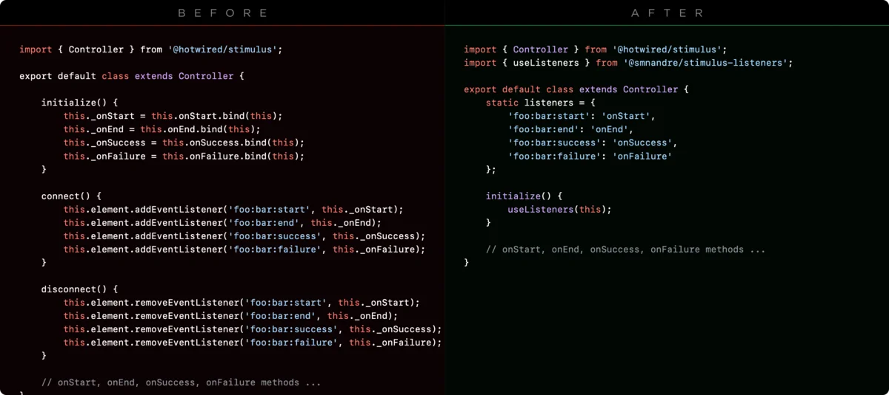

<h1 align=center>Stimulus Listeners</h1>
<picture>
    
</picture>

---

> [!TIP]
> Stimulus Listeners helps you wire up DOM event listeners in Stimulus controllers, both declaratively and imperatively, 
> without the need for additional build steps or decorators. 

If you can, please consider [sponsoring](https://github.com/sponsors/smnandre) this project to support its development and maintenance.

## Features

A zero-build Stimulus plugin that lets you declaratively or imperatively wire up DOM event listeners:

- **Static** via `static listeners = { … }`
- **Imperative** via `useEventListeners(controller, map)`

**Features:**

- Auto-cleanup on `disconnect`
- Supports options (`capture`, `once`, `passive`) and custom targets
- Plain JavaScript & TypeScript compatible
- No decorators or extra tooling needed at runtime

## Installation

To install `stimulus-listeners`, you can use your package manager of choice. Here is the command for npm:

### Using npm

```bash
npm install @smnandre/stimulus-listeners
```

### Using JSDeliver

If you prefer to use a CDN, you can import it directly from JSDeliver:

```js
import { useListeners, useEventListeners } from 'https://cdn.jsdelivr.net/npm/@smnandre/stimulus-listeners@latest';
```

## Usage

### Static `listeners`

You can define event listeners directly in your Stimulus controller using the `static listeners` property. This allows 
you to declaratively specify which events to listen for and the corresponding methods to call.

This approach is straightforward and integrates seamlessly with Stimulus's lifecycle.

```js
import { Controller } from '@hotwired/stimulus';
import { useListeners } from '@smnandre/stimulus-listeners';

export default class extends Controller {
  
  static listeners = {
    'foo:bar:created': 'onFooBarCreated',
    'foo:bar:closed': 'onFooBarClosed',
  };

  initialize() {
    useListeners(this);
  }

  onFooBarCreated() { /** ... */ }

  onFooBarClosed() { /** ... */ }
}
```

### Listener options

You can also define listeners with options like `capture`, `once`, and `passive`, or specify custom targets.

```js
import { Controller } from '@hotwired/stimulus';
import { useListeners } from '@smnandre/stimulus-listeners';

export default class extends Controller {

  static listeners = {
    'keydown': ['onKeydown', {once: true}],
    'scroll': {method: 'onScroll', passive: true, target: window}
  }
  
  // ...
}
```

### Imperative listeners

An alternative to the static approach is to use the `useEventListeners` function, which allows you to set up event 
listeners imperatively. This is useful for dynamic scenarios where you need to add or remove listeners based 
on certain conditions.

```js
import { Controller } from '@hotwired/stimulus';
import { useEventListeners } from '@smnandre/stimulus-listeners';

export default class LegacyController extends Controller {
  initialize() {
    useEventListeners(this, {
      'blur': this.animatedValue ? 'animateOnBlur' : 'onBlur',
    });
  }

  animateOnBlur(e: Event) {
    // ...     

```

## Testing

To run the test suite:

```bash
npm install
npm test
```

To generate a coverage report:

```bash
npm run test:coverage
```

## License

[`stimulus-listeners`](https://github.com/smnandre/nmsize) is released by [Simon André](https://github.com/smnandre) under the [MIT License](LICENSE).
